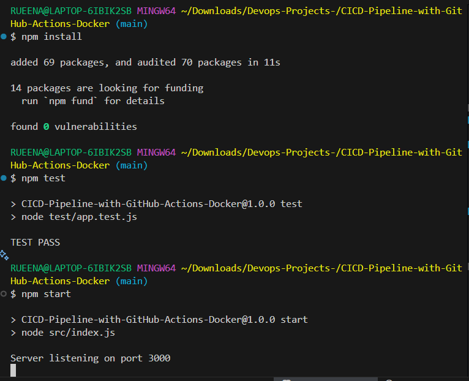
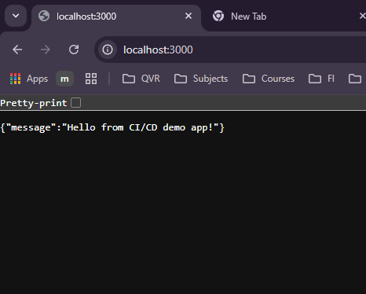

# CI/CD Pipeline Demo - Node + Docker + GitHub Actions

## What it does
- Runs tests on push/PR
- Builds Docker image and pushes to Docker Hub
- Deploys to Minikube (local) or run with docker-compose

# CICD-Pipeline-with-GitHub-Actions-Docker  
This repository contains a sample Node.js application that demonstrates a CI/CD pipeline using GitHub Actions and Docker. The pipeline includes automated testing, building a Docker image, and pushing it to Docker Hub.

## Prerequisites
- A GitHub account
- A Docker Hub account
- GitHub repository with the code
- Docker installed locally for testing

## Setup Instructions
1. **Clone the Repository**: Clone this repository to your local machine.
   ```bash
   git clone
    ```
2. **Create Docker Hub Repository**: Create a new repository on Docker Hub to store your Docker images.
3. **Set Up GitHub Secrets**: In your GitHub repository, navigate to `Settings` > `Secrets` and add the following secrets:
    - `DOCKERHUB_USERNAME`: Your Docker Hub username.
    - `DOCKERHUB_ACCESS TOKEN`: A Docker Hub access token or password.
4. **Push Changes**: Push any changes to the `main` branch to trigger the GitHub Actions workflow.

## Workflow Overview
The GitHub Actions workflow defined in `.github/workflows/ci-cd.yml` performs the following steps:

1. **Checkout Code**: Checks out the code from the repository.
2. **Set Up Node.js**: Sets up the Node.js environment.
3. **Install Dependencies**: Installs the necessary dependencies using npm.
4. **Run Tests**: Executes the test suite to ensure code quality.
5. **Build Docker Image**: Builds a Docker image of the application.
6. **Push Docker Image**: Pushes the Docker image to Docker Hub.

## Quick start
1. `npm install`
2. `npm test`
3. `docker build -t <user>/ci-cd-node-docker:latest .`
4. `docker run -p 3000:3000 <user>/ci-cd-node-docker:latest`

## CI
- Workflow file: `.github/workflows/ci-cd.yml`.
- Requires GitHub secrets: `DOCKERHUB_USERNAME`, `DOCKERHUB_TOKEN`.

## Deploy to Minikube
1. `minikube start --driver=docker`
2. `kubectl apply -f k8s/deployment.yaml`
3. `minikube service cicd-node-service --url`


## Screenshots
### GitHub Actions Workflow


### Local Test






## Conclusion
This project demonstrates how to set up a CI/CD pipeline using GitHub Actions and Docker. By following the steps outlined above, you can automate the testing and deployment of your applications, ensuring faster and more reliable releases.


